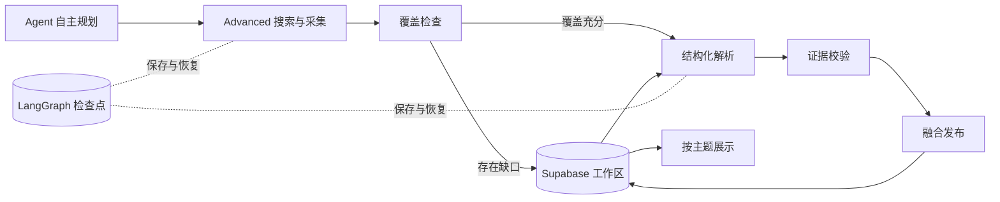

# 炽橙 · 全球工业智能领域导航

面向炽橙科技的独立行业研究工作台。Next.js App Router + Tailwind CSS + LangGraph JS + Supabase，支持 Vercel 部署。无需账号登录。

## 本地运行

需要 Node.js 22 或更新版本。

```sh
npm ci
npm run dev
```

打开 http://127.0.0.1:3000 。不配置云服务时使用本地持久化工作区；系统不会填充演示情报。

本地服务需要外网访问权限。若所有来源立即失败并显示 `EACCES / EPERM`，请停止受限环境中启动的进程，在正常终端重新运行 `npm start`（生产构建）或 `npm run dev`。浏览器能打开网页并不代表服务端进程可以联网。修复网络后，在运行记录中恢复原任务，无需重新配置密钥。

在「智能体记录」输入任一服务商 API Key，选择服务商并保存，随后「开始研究」。密钥 AES-256-GCM 加密后保存，不会回传前端。本地首次保存密钥时生成 `.data/encryption.key`，请与 `.data/workspace.json` 一起备份。

## 已实现的功能

- 情报展示：重大信号、跨事件综合洞察、情报搜索 / 分类 / 重要度排序、企业官网画像与来源原文。综合洞察提炼共同变化、竞争逻辑及炽橙启示，并关联多个已核验事件。
- 企业画像：叙事、定位、产品方案、能力、投融资披露、对炽橙的分析启示。
- 来源配置：关键词、研究企业、网站 / 公开文章 / RSS，支持增删、编辑、启停与保存。
- 智能体记录：DeepSeek、OpenAI、GLM、Qwen 密钥与模型名配置，最终选择保存；运行状态、节点日志、手动全量重研及失败恢复。每日增量研究不提供手动入口。
- 每日计划：北京时间 19:00 开始；Vercel Cron 使用 UTC 11:00。
- 内容融合：事件标识去重、引用集合合并、长期画像更新；重复抓取不会把旧新闻日期刷新成今天。
- 新闻、企业动态、投融资资讯按原文发布时间严格限制最近 120 小时。未知日期、未来日期不进入新闻流；研究与画像长期保留。

## 研究 Harness



代码在 `src/server/research.ts`：使用一个工业情报研究 Agent 和真实 `StateGraph`。Agent 负责规划研究问题、审查覆盖缺口和分析材料；Harness 负责工具调用、异步分批、源站并发预算、页面大小与超时限制、结构化输出校验、引用原文比对、幂等发布、每日幂等 ID、工作区互斥与失败恢复。

本地通过文件检查点持久化；云端使用官方 `PostgresSaver`，在私有 `research_checkpoints` schema 保存检查点。模型密钥只存在调用闭包中，不进入图状态或检查点。单次运行预算 255 秒；HTTP 函数上限 300 秒。恢复会跳过已完成节点；当前失败批次所在解析节点会重跑，因此可能再次产生模型费用。

全量和增量使用同一套自主研究 Harness。全量检索最近 30 天并重建新闻展示；增量每天 19:00 自动检索上次成功运行后的变化并融合有效历史。企业官网画像不受新闻窗口限制。证据校验后，使用完整有效事件集合生成综合洞察，随新闻一起发布；洞察失败不阻断新闻发布。Tavily 统一使用 Search Advanced，每次最多 100 份有效来源进入分析。产品与技术细则以 `说明.md` 为准。

产品能力、搜索参数、数据融合和运行记录字段详见[系统说明](./说明.md)。

## 部署到 Vercel + Supabase

1. 使用一个本项目专用的 Supabase 项目，运行 `supabase/schema.sql`。该文件为幂等初始化 SQL，不是已执行的数据库迁移。
2. 将仓库导入 Vercel，框架选择 Next.js，使用 lockfile 安装与 `npm run build` 构建。
3. 参考 `.env.example` 配置下表环境变量，勿将任何密钥设置为 `NEXT_PUBLIC_*`。
4. 部署 production，然后从企业可信入口进入「智能体记录」保存模型配置，执行首次研究。

| 变量                        | 用途                                                                 |
| --------------------------- | -------------------------------------------------------------------- |
| `SUPABASE_URL`              | 本项目 Supabase API URL                                              |
| `SUPABASE_SERVICE_ROLE_KEY` | 仅服务端使用的数据库访问密钥                                         |
| `DATABASE_URL`              | Supabase Postgres 会话池连接字符串（5432），用于 LangGraph；启用 SSL |
| `CREDENTIAL_ENCRYPTION_KEY` | 64 位十六进制，即 32 字节加密主密钥；轮换前须迁移已存密钥            |
| `CRON_SECRET`               | 定时接口的 Bearer 密钥                                               |
| `WORKSPACE_ACCESS_TOKEN`    | 由企业可信反向代理注入的写入凭证                                     |
| `TAVILY_API_KEY`            | 启用 Search Advanced、全网研究规划和覆盖补搜                         |

生产环境不会降级到临时文件存储，也不会生成测试或演示情报；配置不完整或连接失败会报错。缺少 `DATABASE_URL` 会阻止研究启动。

### 无需登录的访问边界

界面没有账号系统。公开访问可以浏览情报；生产的配置与模型调用需要企业受控入口。企业代理需先限制来源为受信任内网 / 已有企业访问网络，移除客户端自带的 `x-workspace-token`，再注入与 `WORKSPACE_ACCESS_TOKEN` 相同的值。禁止在任意公开入口无条件注入，也不要把这个值放到前端代码里。

这保证“无需本系统登录”同时不把企业付费模型额度和配置写权限开放给任何互联网访客。没有可信入口时生产界面会明确只读；本地回环地址允许直接操作。

### 每晚 19:00 调度

`vercel.json` 已包含每天 UTC 11:00 的 Cron。Vercel Hobby 的触发精度按小时计算，可能在北京时间 19:00–19:59 执行。若需要分钟级 19:00 触发，可以使用已附的 `supabase/schedule.sql`，通过 pg_cron + pg_net 调用同一接口；先启用这两个扩展并在 Supabase Vault 添加文件注释指定的两项秘密。或者使用支持分钟级调度的 Vercel 套餐。本项目不会自动升级付费套餐。

Cron 接口先登记任务并返回 `202`，研究在响应后异步执行；前端通过工作区轮询展示进度。每日 ID 保证两个调度器重复触发也不会重复发布。服务器失败后可从页面恢复，或用同一天的 Cron 重试；平台本身不自动重试 Vercel Cron。过期运行会在下一次启动时标记失败并释放互斥。

## 数据与安全设计

Supabase 的 `research_workspace` 是单企业工作区 JSONB 文档，包含配置、加密凭据、研究条目、画像与记录。RLS 已启用且 `anon` / `authenticated` 无权限，只有服务端 `service_role` 可访问。服务端 API 只返回脱敏后的数据。发布和配置更新用版本号 compare-and-swap 实现原子写入；配置窗口另有 revision 防止覆盖他人的更新。

这一结构适合单企业低并发研究主页。随着多年材料积累，可将历史条目与节点日志拆到独立分页表；目前接口返回当前全部研究条目和最近 40 次运行，新闻历史仍在库中保留。

采集只接受公网 HTTP(S)，限制端口、重定向、DNS 解析及连接目标，阻止 loopback、内网、链路本地和 DNS 重绑定。不执行网页脚本。页面中的指令作为不可信数据处理，模型只能输出结构化研究结果。

## 内容边界

- 默认研究方向依据[炽橙官网](https://www.czy3d.com/about-us/)与[工业多智能体平台](https://www.czy3d.com/aidt/)，不将官网营销主张当成独立验证的行业排名。
- 没有搜索服务时，研究关键词用于已配置站点的筛选和分析，不是搜索引擎。
- 融资字段使用可核验原文，否则显示“未披露”；原文引用匹配不能替代独立事实核查。
- HTML / RSS 采集已实现；需要浏览器渲染的站点、PDF 全文、付费数据库属于当前采集器的边界。
- 系统不会自动填充测试或演示情报；首次发布前情报展示为空。

## 验证

```sh
npm test
npm run build
npm start
# 另一终端；本机测试默认使用 Edge，其他平台修改 playwright.config.ts 的 channel
npm run test:e2e
```

单元 / 集成测试覆盖时间边界、融合幂等、画像保留、SSRF、同源写入保护、密钥不泄露、原文证据以及真实 LangGraph 失败恢复。模型与采集在 Harness 测试中使用明确的测试夹具，不调用付费 API。

浏览器测试验证桌面与手机页面、筛选、详情、配置持久化、模型选择以及 API 拦截。界面截图保存在 `artifacts/`。

## 官方参考

- [LangGraph 持久化](https://docs.langchain.com/oss/javascript/langgraph/persistence)
- [Supabase JS upsert](https://supabase.com/docs/reference/javascript/upsert)
- [Supabase 定时调用](https://supabase.com/docs/guides/functions/schedule-functions)
- [Vercel Cron 调度精度](https://vercel.com/docs/cron-jobs/usage-and-pricing)

云端数据库、付费模型真实调用和生产调度只有在项目凭据配置后才能完成线上验收；本地通过的测试不代表这些外部服务已上线。
