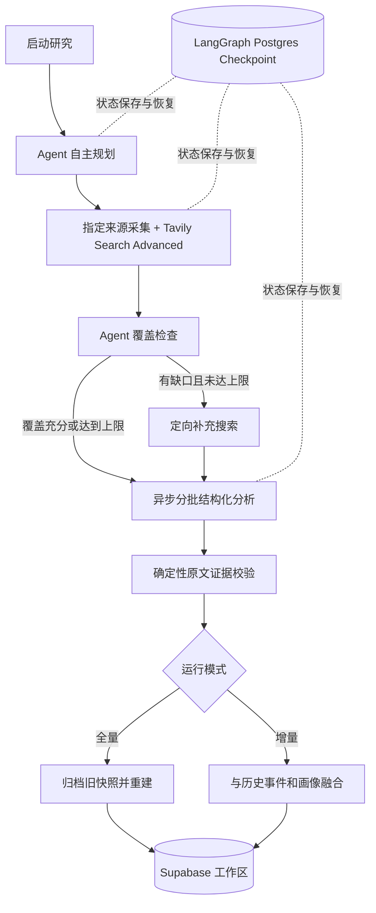

# 全球工业智能导航：产品与技术说明

## 1. 产品定位

全球工业智能导航是炽橙科技的独立行业研究主页，持续关注工业互联网、工业智能、3D 模型 + AI、制造业 + AI、数字孪生、智能运维，以及企业科技动态、产品方案、新技术能力和投融资市场变化。

系统无需账号登录，提供三个模块：

- 情报展示：按主题、类别和重要度展示可核验研究结论、重大信号、近 30 天行业趋势、动态热词、领域动量和重点企业画像。左侧导航支持抽屉式收起；重大信号超过 3 条时可横向轮播。
- 来源配置：维护研究关键词、重点企业，以及网站、RSS、微信公众号公开文章等指定来源。
- 智能体记录：配置 DeepSeek、OpenAI、GLM、Qwen，查看自主研究过程、来源统计、证据校验、失败恢复和发布结果。

所有情报与企业研究事实统一采用最近 30 天滚动窗口。每日增量任务补充当天变化并融合历史数据，第 31 天及更早的信息会自动退出当前展示；旧全量快照仍保留在归档中。

## 2. 全量重研与每日增量研究

### 2.1 全量重研

全量重研由用户在页面手动启动，是当前唯一的手动研究入口。

系统会：

1. 读取全部默认研究方向。
2. 读取用户配置的全部关键词、重点企业和启用来源。
3. 将搜索时间范围设为最近 30 天。
4. 由研究 Agent 生成补充搜索问题和优先顺序。
5. 执行常规行业、配置关键词、重点企业、指定网站四类确定性搜索，并加入 Agent 自主规划的问题。
6. 检查主题、企业和内容类型覆盖情况，对缺口执行一次定向补充搜索。
7. 对有效正文进行结构化分析、原文引用校验和重要度分级。
8. 将旧的当前研究快照归档，使用本轮通过验证的内容重建情报和企业画像。

全量重研不会删除运行记录。系统最多保留最近 12 份旧快照归档，以控制单工作区 JSONB 数据量。

### 2.2 每日增量研究

增量研究不提供页面按钮，由系统每天北京时间 19:00 自动运行。`vercel.json` 使用 UTC 11:00 的 Vercel Cron 表达式。

增量研究与全量重研使用同一套 LangGraph Harness、规划逻辑、Advanced 搜索、覆盖检查、补充搜索、结构化分析和证据校验。区别仅在研究窗口和发布方式：

- 检索起点取上次成功或部分成功运行时间，并向前重叠 48 小时，防止延迟发布或页面更新时间变化导致遗漏。
- 第一次增量运行默认检索最近 48 小时。
- 后续增量以最近一次成功运行时间向前重叠 48 小时，统一使用精确 `start_date`。
- 发布后只保留最近 30 天有效信息，并自动剔除第 31 天以前的事件和过期发现企业。
- 新事件按稳定事件标识和规范化 URL 去重，与历史引用合并。
- 配置企业始终保留跟踪席位并在全量研究中刷新；研究新发现的企业在最近 30 天内动态展示。
- 当天任务使用确定性 ID；重复 Cron 不会重复发布。

任务只要完成证据校验和融合发布，就标记为“已完成”。个别网址读取失败、搜索问题失败或部分候选未通过证据校验属于非致命警告，会继续保留在运行日志中，但不再把已经发布成功的研究误标为“部分完成”。只有流程未能到达发布节点时才标记失败并提供检查点恢复。

## 3. 单 Agent LangGraph Harness

系统采用一个“工业情报研究 Agent”，不使用多个业务 Agent。模型承担需要判断与推理的工作；程序节点 Harness 承担可确定执行和必须受控的工作。



### Agent 负责

- 根据模式、时间窗口、默认方向和用户配置制定研究策略。
- 生成最多 12 个额外的高价值搜索问题。
- 阅读已采集材料的标题、来源和日期，判断覆盖是否充分。
- 针对缺口生成最多 12 个定向补充问题。
- 从正文提取事件、企业叙事、定位、产品方案、能力、投融资和对炽橙的分析启示。

### Harness 负责

- 确保所有默认方向和全部用户配置都进入确定性搜索计划。
- 搜索、网页抓取、SSRF 防护、页面大小限制和超时。
- 并发搜索、并发正文读取和异步模型分批。
- 最大 100 份有效来源的硬限制及来源维度轮转选择。
- Zod 结构化输出检查、模型输出兼容归一化和失败重试。
- 逐字引用与原始正文匹配；没有匹配证据的内容禁止发布。
- LangGraph Postgres Checkpoint、失败恢复、任务互斥和幂等发布。
- 模型密钥隔离：密钥只在调用闭包中解密，不进入图状态和检查点。

## 4. 搜索和覆盖策略

系统只使用 Tavily Search API，不使用 Tavily Research API。

所有开放网络搜索采用：

```json
{
  "search_depth": "advanced",
  "chunks_per_source": 3,
  "max_results": 10,
  "topic": "general 或 news",
  "start_date": "YYYY-MM-DD"
}
```

增量模式每个问题最多返回 8 条，全量模式最多返回 10 条。所有查询均使用 `start_date`：增量按上次成功运行向前重叠 48 小时，全量为当前日期向前 30 天。

确定性搜索计划包括：

- 常规行业：行业动态、前沿技术、产品与方案、企业战略、产业市场、资本市场。
- 配置关键词：全部关键词按最多 4 个一组生成查询。
- 重点企业：全部企业按最多 3 家一组，搜索战略/定位/产品/技术/合作/客户；全量模式另外搜索融资/投资/并购/财报/市场份额。
- 指定网站：为每个启用来源域名生成站点限定查询，同时直接采集配置 URL。
- 自主补充：研究 Agent 根据研究目标生成的问题，以及覆盖检查阶段生成的定向补充问题。

搜索按 4 个问题并发执行，正文按 6 个 URL 并发读取。搜索结果必须经过 URL 规范化、重复删除、公网地址验证、正文读取、内容质量校验和时间窗口筛选，才能成为有效来源。

系统按照覆盖率推进，但任何一次运行最多允许 100 份有效来源进入模型分析。首次搜索预留部分容量给覆盖补充，避免宽泛结果占满全部预算；达到 100 份后停止补搜。

## 5. 异步执行

手动全量重研和定时增量研究都会先创建运行记录并返回 HTTP `202 Accepted`。Next.js `after()` 在响应返回后继续执行 LangGraph，前端在任务运行期间每 3 秒读取工作区状态。

研究内部采用有界异步：

- Tavily 查询每组最多并发 4 个。
- 正文读取每组最多并发 6 个。
- 结构化分析每批最多 10 份材料，每组最多并发 2 批。
- 单次函数运行预算 255 秒，Vercel 路由上限 300 秒。
- 超时或进程中断时保留 LangGraph checkpoint，运行记录提供“从检查点恢复”。

`after()` 仍受 Vercel Function 最大执行时间约束，它不是无限时长队列。100 份是硬上限而不是每次必须达到的数量；实际数量由搜索覆盖、网页可访问性、模型速度和函数时间预算共同决定。

## 6. 运行记录与来源统计

每次运行记录按节点展示详细日志，并保存以下统计：

| 字段 | 含义 |
| --- | --- |
| 搜索范围 | 本轮实际执行的确定性、自主规划和补充搜索问题数量 |
| 搜索结果 | Tavily 各查询返回结果数量之和，包含查询之间的重复 URL |
| 去重后 | 搜索结果完成 URL 规范化和去重后的候选数量 |
| 读取正文 | 配置来源和开放网络候选中成功解析正文的数量 |
| 有效内容 | 完成正文去重、内容质量检查和时间窗口筛选后的数量 |
| 进入分析 | 按覆盖维度轮转并受 100 份上限约束后交给模型的数量 |
| 读取失败 | 因网络、超时、反爬、验证页、格式或正文不足而失败的数量 |

开放网络日志会分别显示搜索问题数、原始结果数、URL 去重数、正文成功数、有效内容数、读取失败数和搜索请求失败数。运行详情顶部提供聚合统计卡片。

## 7. 内容分析与发布规则

- 不按来源逐篇生成摘要，而是按事件、主题和企业进行跨来源整合。
- 信息类别包括技术前沿、产品发布、解决方案、企业战略、产业市场和资本动态。模型按明确语义分类，服务端再依据事实关键词校正；没有数据的分类不显示空标签。
- 信息方向包括工业互联网、工业智能、3D 模型 + AI、制造业 + AI、数字孪生和智能运维。
- 重大信息不是简单统计全部 `critical` / `high`：`critical` 至少需要 1 条证据且可信度不低于 0.72；`high` 至少需要 2 条证据且可信度不低于 0.82。通过门槛后按重要度、可信度、证据数量和时效评分排序，并在横向轮播中完整展示。
- 每条情报至少包含一个能够在正文中逐字匹配的引用。
- 融资金额、轮次和交易信息无法逐字核验时显示“未披露”。
- 页面内容始终视为不可信数据，其中的提示词或操作指令不会被执行。
- 同一事件复用稳定 `eventKey`，重新发现不会把旧新闻日期刷新成当前日期。

### 展示分析逻辑

- 行业趋势：把最近 30 天分为 6 个五日区间，按重要度加权展示最活跃的研究领域变化。
- 热点热词：使用中文分词从当前标题和摘要动态提取，并融合用户配置关键词、企业和研究方向；点击热词可直接筛选情报。
- 领域趋势：比较最近 7 天与此前 23 天的日均加权信号，展示上升、稳定或回落动量。
- 情报分类：先由模型依据六类语义框架分类，再由服务端对融资、论文、案例、产品发布和战略等强特征进行一致性校正。
- 企业观察：配置企业固定优先展示并持续刷新；Agent 新发现的相关企业作为动态观察对象，超过 30 天无新有效材料后退出当前列表。

### 模型名称校验

模型名称改为受控选择，前端不再允许任意拼写，服务端保存时再次校验。当前清单为 DeepSeek V4 Flash/Pro、OpenAI GPT-4.1 mini/4.1、GLM-5.2、Qwen3.7 Plus/3.8 Max/Qwen Plus。旧的 `deepseek-chat`、`deepseek-reasoner` 和 `glm-4-plus` 配置会迁移到当前推荐模型；DeepSeek 与 GLM 的结构化研究请求关闭思考输出，Qwen 关闭 thinking，避免推理文本破坏 JSON 发布契约。

## 8. 持久化与安全

- Supabase `research_workspace` 保存配置、加密凭据、当前研究快照、旧快照归档和运行记录。
- LangGraph checkpoint 位于私有 `research_checkpoints` schema。
- API Key 由 AES-256-GCM 加密；`CREDENTIAL_ENCRYPTION_KEY` 仅作为服务端环境变量存在。
- 生产写操作需要 `WORKSPACE_ACCESS_TOKEN`，公开入口默认只读；本地回环地址可直接调试。
- `CRON_SECRET` 验证 Vercel Cron 的 Bearer 请求。
- 来源采集拒绝回环、私网、链路本地、非标准端口、带账号密码的 URL 和 DNS 重绑定。

## 9. 环境变量

| 变量 | 必需性 | 用途 |
| --- | --- | --- |
| `SUPABASE_URL` | 生产必需 | Supabase 项目 API URL |
| `SUPABASE_SERVICE_ROLE_KEY` | 生产必需 | 服务端工作区读写 |
| `DATABASE_URL` | 生产研究必需 | Supabase Shared/Session Pooler 5432 连接，用于 LangGraph checkpoint |
| `CREDENTIAL_ENCRYPTION_KEY` | 生产必需 | 64 位十六进制凭据加密主密钥 |
| `CRON_SECRET` | 定时任务必需 | Cron Bearer 校验密钥 |
| `WORKSPACE_ACCESS_TOKEN` | 生产管理必需 | 页面管理口令和写操作保护 |
| `TAVILY_API_KEY` | 开放网络研究必需 | Search Advanced、覆盖检查和补充搜索 |

DeepSeek、OpenAI、GLM、Qwen 的 API Key 由管理员在页面中填写并加密保存，不设置为 Vercel 环境变量。

## 10. 当前技术边界

- 只能读取公开可访问的网页、RSS 和微信公众号公开文章链接，不绕过登录、验证码或平台访问控制。
- 不执行网页 JavaScript；强依赖客户端渲染的页面可能无法获得正文。
- PDF 全文、付费数据库和需要浏览器自动化的站点不在当前采集器范围内。
- Search Advanced 提升检索深度，但最终质量仍取决于搜索覆盖、来源可访问性、发布时间元数据和模型能力。
- 全量重研是最近 30 天范围内的覆盖式研究，不是无限制抓取整个互联网。
